  

  <strong>GhostForge Dev by Juan Gamba Saenz</strong> — High-performance full-stack web development with PHP (Laravel, Vue.js) & Java (Spring Boot). Systems engineering student portfolio & blog.

  
  
  
  
  
  

  

  <em>Perfect Lighthouse scores.</em>

---

## Overview

GhostForge Dev is a brand name that Juan David Gamba Saenz uses for freelance project development.

GhostForge Dev is currently experiencing its birth, as a commercial brand with great potential of growth and development of high-capacity projects.

This repository is public for job recruiters such as LinkedIn recruiters.

Built on Astro 7 and Tailwind CSS v4.

**[Juan Gamba Saenz Live Website → juandgambas.github.io](https://juandgambas.github.io)** · **[Template Built by Hans Martens → hansmartens.dev](https://hansmartens.dev)**

> **Origins & credits.** Astro Rocket was originally forked from [Velocity](https://github.com/southwellmedia/velocity) by [Southwell Media](https://southwellmedia.com). Velocity provided the solid base — a well-engineered Astro boilerplate with a thoughtful design system and component library — and full credit for that foundation goes to the Southwell Media team. Since then, Astro Rocket has evolved into a theme in its own right, with far more to offer than the original: live colour-theme switching, built-in i18n, static search, project galleries with video, blog comments, durable internal links, and much more — see [What Astro Rocket has to offer](#what-astro-rocket-has-to-offer) below.

---

## What GhostForge Dev has to offer

| Feature             | Description                                                                                     |
| ------------------- | ----------------------------------------------------------------------------------------------- |
| **Astro 7**         | Latest version with the Rust compiler, Vite 8, Content Layer API, and performance optimizations |
| **Tailwind CSS v4** | CSS-first configuration with OKLCH color system and fluid typography                            |

---

## Security

**Reporting a security issue.** If you find a real vulnerability in this repository, please report it privately — open a [GitHub security advisory](https://github.com/juandgambas/juandgambas.github.io/security/advisories/new) or email jdgambas.desarrollador@gmail.com — rather than a public issue, so it can be fixed before it's widely known.

---

## Contributing

Contributions are welcome!

1. Fork the repository
2. Create a feature branch (`git checkout -b feature/amazing-feature`)
3. Commit your changes (`git commit -m 'Add amazing feature'`)
4. Push to the branch (`git push origin feature/amazing-feature`)
5. Open a Pull Request

Please ensure your code passes linting (`pnpm lint`) and type checking (`pnpm check`) before submitting.

---

## 📄 License

This project is under a **mixed license**:

- **Source Code ([MIT License](LICENSE)):** You are free to use the architecture, logic, and components of this Astro site for your own projects.
- **Personal Content (All Rights Reserved):** All texts, images, showcased projects, personal branding, and blog articles are owned by **Juan David Gamba Saenz**. Copying, reproducing, or distributing these materials without prior written authorization is strictly prohibited.

---

## Links

- [Juan Gamba Website on GitHub](https://github.com/juandgambas/juandgambas.github.io)
- [Astro Rocket on GitHub](https://github.com/hansmartensdev/astro-rocket)
- [Velocity](https://github.com/southwellmedia/velocity) by [Southwell Media](https://southwellmedia.com) — the theme Astro Rocket was originally forked from
- [Astro Documentation](https://docs.astro.build)
- [Tailwind CSS v4](https://tailwindcss.com/docs)

---

**GhostForge Dev Website** is designed and maintained by [Juan David Gamba Saenz](https://juandgambas.github.io).

**Astro Rocket** is designed and maintained by [Hans Martens](https://hansmartens.dev), independently of the present project.
Astro Rocket was originally forked from [Velocity](https://github.com/southwellmedia/velocity) by [Southwell Media](https://southwellmedia.com) — credit to them for the solid base it grew from.
